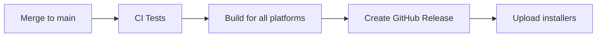

# CI/CD Setup Guide

This document explains how the CI/CD pipeline works and what's needed to enable automated releases.

## 🚀 What's Automated

### CI Pipeline (`ci.yml`)

**Runs on**: Every push and pull request to `main` or `develop` branches

**Steps**:

1. ✅ Type checking (`npm run typecheck`)
2. ✅ Linting (`npm run lint`)
3. ✅ All 282 tests (`npm run test:renderer` + `npm run test:main`)
4. ✅ Build verification (`npm run build`)

**Purpose**: Catch bugs before they reach production

---

### CD Pipeline (`release.yml`)

**Runs on**: Push to `main` branch or version tags (`v*`)

**Builds**:

- 🍎 **macOS** - `.dmg` installer
- 🪟 **Windows** - `.exe` setup
- 🐧 **Linux** - `.AppImage`, `.deb`, `.snap`

**Steps**:

1. Run full CI checks (type, lint, test)
2. Build platform-specific installers
3. Publish to GitHub Releases
4. Generate release notes

**Purpose**: Automatic releases when merging to main

---

## ⚙️ Required Setup

### 1. GitHub Token (Already Available)

The `GITHUB_TOKEN` is automatically provided by GitHub Actions - no setup needed!

This token allows publishing releases to your repository.

---

### 2. Optional: Code Signing (Recommended for Production)

#### Why Code Signing?

- **macOS**: Required for Gatekeeper (users won't see scary warnings)
- **Windows**: Required for SmartScreen (avoids "Unknown Publisher" warnings)
- **Linux**: Not required

#### Without Code Signing

The workflow will still work! Users will see:

- macOS: "App is from an unidentified developer"
- Windows: "Windows protected your PC"

Users can still install by clicking "Open Anyway" or "More info → Run anyway"

#### With Code Signing (Optional)

##### macOS Code Signing Secrets:

```bash
# Required for macOS notarization
CSC_LINK=<base64 encoded .p12 certificate>
CSC_KEY_PASSWORD=<certificate password>
APPLE_ID=<your Apple ID email>
APPLE_APP_SPECIFIC_PASSWORD=<app-specific password>
APPLE_TEAM_ID=<your Apple Developer Team ID>
```

##### Windows Code Signing Secrets:

```bash
# Required for Windows code signing
CSC_LINK=<base64 encoded .pfx certificate>
CSC_KEY_PASSWORD=<certificate password>
```

##### How to Get Certificates:

- **macOS**: [Apple Developer Program](https://developer.apple.com/programs/) ($99/year)
- **Windows**: [Code Signing Certificate providers](https://comodosslstore.com/code-signing) (~$200/year)

##### How to Encode Certificates:

```bash
# macOS (.p12 file)
base64 -i certificate.p12 -o encoded.txt

# Windows (.pfx file)
base64 -i certificate.pfx -o encoded.txt
```

Then add the content of `encoded.txt` as a GitHub secret.

---

## 🔐 Adding GitHub Secrets

1. Go to your repository on GitHub
2. Navigate to: **Settings → Secrets and variables → Actions**
3. Click **"New repository secret"**
4. Add the secrets listed above (only if you have certificates)

---

## 📦 How Releases Work

### Automatic Release Flow:



### Version Management:

The version is controlled by `package.json`:

```json
{
  "version": "1.0.0"
}
```

**To release a new version:**

1. Update version in `package.json`
2. Commit: `git commit -m "chore: bump version to 1.0.1"`
3. Merge to main
4. Automatic release is created!

**OR use npm version:**

```bash
npm version patch  # 1.0.0 → 1.0.1
npm version minor  # 1.0.0 → 1.1.0
npm version major  # 1.0.0 → 2.0.0
git push && git push --tags
```

---

## 📝 Release Notes

Release notes are automatically generated from commit messages between releases.

**Good commit messages help:**

```bash
# Good - descriptive
feat: add dark mode toggle
fix: resolve connection timeout issue
docs: update installation guide

# Bad - not descriptive
update stuff
fixes
wip
```

---

## 🧪 Testing the Workflow

### Test CI (without releasing):

```bash
# Create a PR or push to develop branch
git checkout -b test-ci
git push origin test-ci
```

### Test Release (without code signing):

```bash
# Just merge to main - it will create unsigned builds
git checkout main
git merge your-feature-branch
git push origin main
```

The workflow will:

1. ✅ Run all tests
2. ✅ Build installers for all platforms
3. ✅ Create a GitHub Release with artifacts
4. ⚠️ Show "unsigned" warnings when users install (unless you add code signing)

---

## 🎯 Quick Start (Minimal Setup)

**You can start using CI/CD right now with zero configuration!**

1. ✅ CI tests run automatically on every PR
2. ✅ Releases are created automatically when merging to main
3. ⚠️ Apps will be unsigned (users see warnings, but can still install)

**Later, when ready for production:**

- Add code signing certificates to remove warnings
- Users get seamless installs with no warnings

---

## 🔍 Monitoring Releases

### View Workflow Status:

- Go to **Actions** tab in your GitHub repository
- See real-time build progress for each platform
- Download build logs if something fails

### View Published Releases:

- Go to **Releases** tab in your GitHub repository
- See all published versions with installers
- Download installers for testing

---

## 🆘 Troubleshooting

### Build Fails on macOS:

- Check if `keytar` dependency builds correctly
- Ensure macOS runner has necessary build tools

### Build Fails on Windows:

- Check if native dependencies compile
- Ensure Python is available for native modules

### Build Fails on Linux:

- Check AppImage, snap, and deb build requirements
- Ensure necessary Linux build tools are installed

### Release Not Created:

- Check `publish` configuration in `electron-builder.yml`
- Verify `GH_TOKEN` has correct permissions
- Check workflow logs in Actions tab

---

## 📚 Additional Resources

- [electron-builder Documentation](https://www.electron.build/)
- [GitHub Actions Documentation](https://docs.github.com/en/actions)
- [Apple Code Signing Guide](https://developer.apple.com/documentation/xcode/notarizing_macos_software_before_distribution)
- [Windows Code Signing Guide](https://www.electron.build/code-signing#windows)

---

## 🎉 Summary

✅ **CI tests run automatically** - catch bugs early
✅ **Releases are automated** - no manual builds needed
✅ **Works immediately** - no setup required to start
🔐 **Code signing optional** - add later for production
📦 **Multi-platform builds** - macOS, Windows, Linux
🚀 **Fast releases** - merge to main and you're done!
