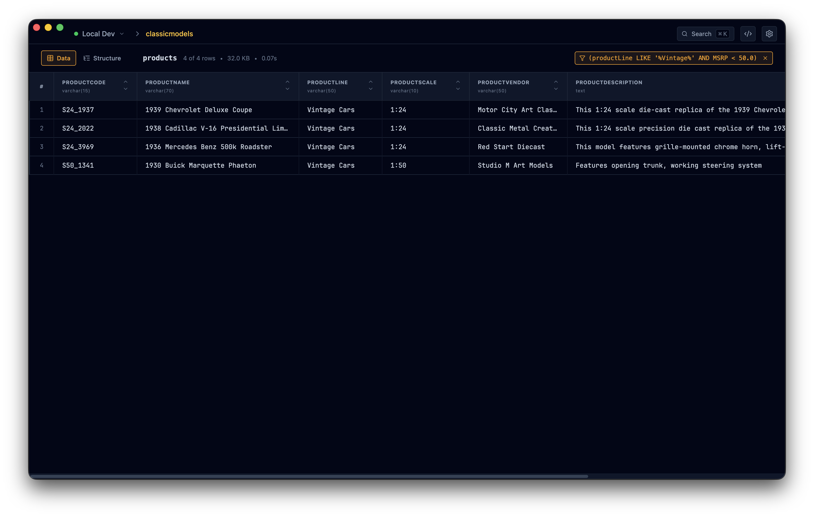
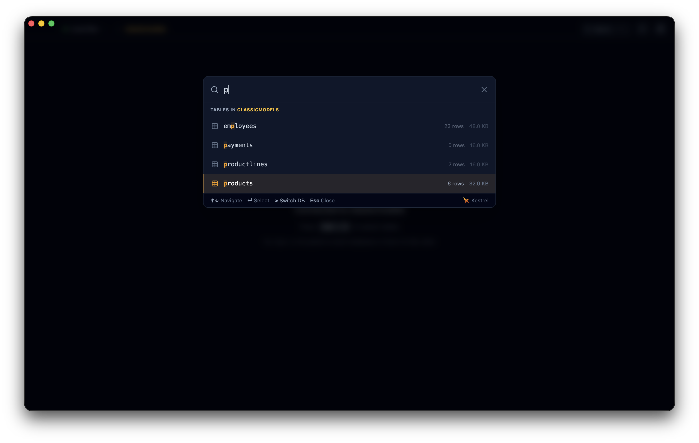
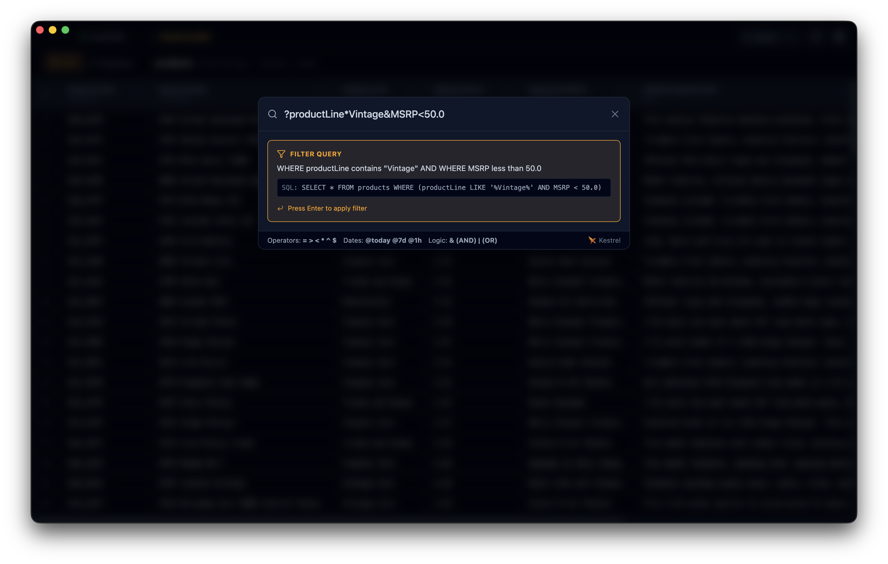

# Kestrel DB

<p align="center">
  <strong>Precision Data Exploration for MySQL</strong>
</p>

<p align="center">
  <a href="https://github.com/tazgreenwood/kestrel-db/actions/workflows/ci.yml">
    
  </a>
  <a href="https://github.com/tazgreenwood/kestrel-db/actions/workflows/release.yml">
    
  </a>
  
  
  
</p>

<p align="center">
  
</p>

<p align="center">
  
</p>

A modern, keyboard-first MySQL client built with Electron, React, and TypeScript. Navigate your databases with the speed and precision of a kestrel.

## ✨ Key Features

- **⌨️ Keyboard-First Navigation** - Command palette-driven interface for lightning-fast navigation
- **🎨 Beautiful Themes** - Dark mode by default with customizable themes
- **🔍 Smart Search** - Instant table search and filtering with fuzzy matching
- **📊 Advanced Data Grid** - Virtualized tables with sorting, filtering, and column resizing
- **✏️ Powerful SQL Editor** - Monaco-powered editor with autocomplete for tables, columns, and SQL keywords
- **📝 Query Management** - Save frequently-used queries and view query history
- **🎯 Structure View** - View table schemas, indexes, and constraints at a glance
- **💾 Data Export** - Export tables and query results to CSV or JSON
- **🔐 Secure Connections** - Multiple connection support with secure credential storage
- **🎓 First-Run Onboarding** - Interactive tutorial for new users
- **⚡ Error Recovery** - Built-in error boundary to prevent crashes

## 📸 Screenshots

### Data Grid with Filtering



_Advanced filtering with natural query syntax - type `?id>1000` to filter instantly_

### Command Palette



_Keyboard-first navigation - press `Cmd+K` to access all functionality_

### Filter Syntax



_Powerful filter syntax with autocomplete and real-time validation_

## 🚀 Installation

### Download

Visit [kestreldb.com](https://kestreldb.com) to download the latest release for your platform:

- **macOS**: `.dmg` installer
- **Windows**: `.exe` installer
- **Linux**: `.AppImage` or `.deb` package

### Requirements

- **macOS**: 10.15 (Catalina) or later
- **Windows**: Windows 10 or later
- **Linux**: Modern distribution with GTK 3

### ⚠️ Important Notice

Kestrel DB is free, open source software provided "as is" without warranty of any kind. While we strive for reliability:

- **Always backup your data** before performing operations
- **Test on non-production databases first** to familiarize yourself with the tool
- **No guarantee of uptime or data safety** - use at your own risk
- **Review the code** - this is open source, inspect what you're running

See the [LICENSE](LICENSE) file for full legal details.

## 🎯 Quick Start

1. **Launch Kestrel DB** and complete the interactive onboarding tutorial
2. **Create a connection** by entering your MySQL server details
3. **Press `Cmd+K`** (or `Ctrl+K`) to open the command palette
4. **Select a database** by typing its name
5. **Search for a table** and press Enter to view its data
6. **Press `Cmd+/`** to open the SQL editor for custom queries

## ⌨️ Keyboard Shortcuts

Kestrel DB is designed for keyboard-first workflows. Master these shortcuts to work at maximum speed:

### Navigation

- `Cmd/Ctrl + K` - Open command palette
- `Cmd/Ctrl + /` - Open SQL editor
- `Cmd/Ctrl + ,` - Open settings
- `Escape` - Close modals/drawers

### Data Operations

- `Cmd/Ctrl + R` - Refresh current table
- `Cmd/Ctrl + T` - Toggle between Data and Structure view
- `Cmd/Ctrl + E` - Export current table
- `Cmd/Ctrl + F` - Filter table data

### SQL Editor

- `Cmd/Ctrl + Enter` - Execute query
- `Cmd/Ctrl + S` - Save query
- `Cmd/Ctrl + H` - View query history

### Cell Navigation (when table is focused)

- `h/j/k/l` - Navigate cells (Vim-style)
- Arrow keys - Navigate cells
- `Tab` - Move to next cell
- `Shift + Tab` - Move to previous cell

### Command Palette Actions

- Type table name - Search and select tables
- `>` - Switch database
- `?` - Filter current table
- `@` - Switch connection
- `/export` - Export current table

## 🛠️ Development

### Prerequisites

- **Node.js** 18 or later
- **npm** 9 or later

### Project Setup

```bash
# Clone the repository
git clone https://github.com/tazgreenwood/kestrel-db.git
cd kestrel-db

# Install dependencies
npm install

# Start development server with hot reload
npm run dev
```

### Development Commands

```bash
# Type checking
npm run typecheck        # Check all TypeScript
npm run typecheck:node   # Check main/preload only
npm run typecheck:web    # Check renderer only

# Code quality
npm run lint             # Run ESLint
npm run format           # Format with Prettier
```

### Building for Production

```bash
# Build for all platforms
npm run build

# Platform-specific builds
npm run build:mac        # macOS (.dmg)
npm run build:win        # Windows (.exe)
npm run build:linux      # Linux (.AppImage, .deb)

# Build without packaging (for testing)
npm run build:unpack
```

## 🏗️ Architecture

Kestrel DB is built as an Electron application with three main processes:

### Main Process (`src/main/`)

- Window management and app lifecycle
- IPC communication setup
- Native OS integration

### Preload Script (`src/preload/`)

- Secure bridge between main and renderer processes
- Exposes Electron APIs via `contextBridge`

### Renderer Process (`src/renderer/`)

- React 19 application with TypeScript
- State management with Zustand
- Styling with Tailwind CSS v4
- Monaco Editor for SQL editing
- TanStack Table for data grids

## 🎨 Tech Stack

- **Electron** - Desktop application framework
- **React 19** - UI framework
- **TypeScript** - Type safety
- **Vite** - Build tool
- **Tailwind CSS v4** - Styling
- **Monaco Editor** - SQL editor with autocomplete
- **Zustand** - State management
- **TanStack Table** - Data grid virtualization
- **mysql2** - MySQL client
- **keytar** - Secure credential storage

## 📝 Configuration

### Theme Customization

Themes can be customized in Settings (`Cmd/Ctrl + ,`):

- Choose from built-in themes or create custom themes
- Adjust font size, font family, and UI scale
- Enable high contrast mode
- Export and import themes

### Performance Settings

- **Default chunk size** - Number of rows to fetch at once (100-10000)
- **Query timeout** - Maximum query execution time
- **Dynamic sizing** - Automatically adjust chunk size based on data

## 🤝 Contributing

Contributions are welcome! Please feel free to submit a Pull Request.

1. Fork the repository
2. Create your feature branch (`git checkout -b feature/amazing-feature`)
3. Commit your changes (`git commit -m 'Add some amazing feature'`)
4. Push to the branch (`git push origin feature/amazing-feature`)
5. Open a Pull Request

## 📄 License

This project is licensed under the MIT License - see the [LICENSE](LICENSE) file for details.

## 🙏 Acknowledgments

- Built with [electron-vite](https://github.com/alex8088/electron-vite)
- Icons from [Lucide](https://lucide.dev/)
- Inspired by modern development tools that prioritize speed and keyboard accessibility
- Color schemes: [Catppuccin](https://catppuccin.com), [Dracula](https://draculatheme.com), [One Dark Pro](https://github.com/Binaryify/OneDark-Pro), [Tokyo Night](https://github.com/enkia/tokyo-night-vscode-theme)

See [THIRD_PARTY_LICENSES.md](THIRD_PARTY_LICENSES.md) for complete third-party attributions and licenses.

## ⚖️ Legal

Copyright © 2025 Taz Greenwood

Kestrel DB is free and open source software licensed under the MIT License. This software is provided "as is", without warranty of any kind, express or implied, including but not limited to the warranties of merchantability, fitness for a particular purpose and noninfringement. See the [LICENSE](LICENSE) file for the full license text.

**Use at your own risk.** Always maintain backups of your data.

---

<p align="center">
  Made with ❤️ by <a href="https://github.com/tazgreenwood">Taz Greenwood</a>
</p>
